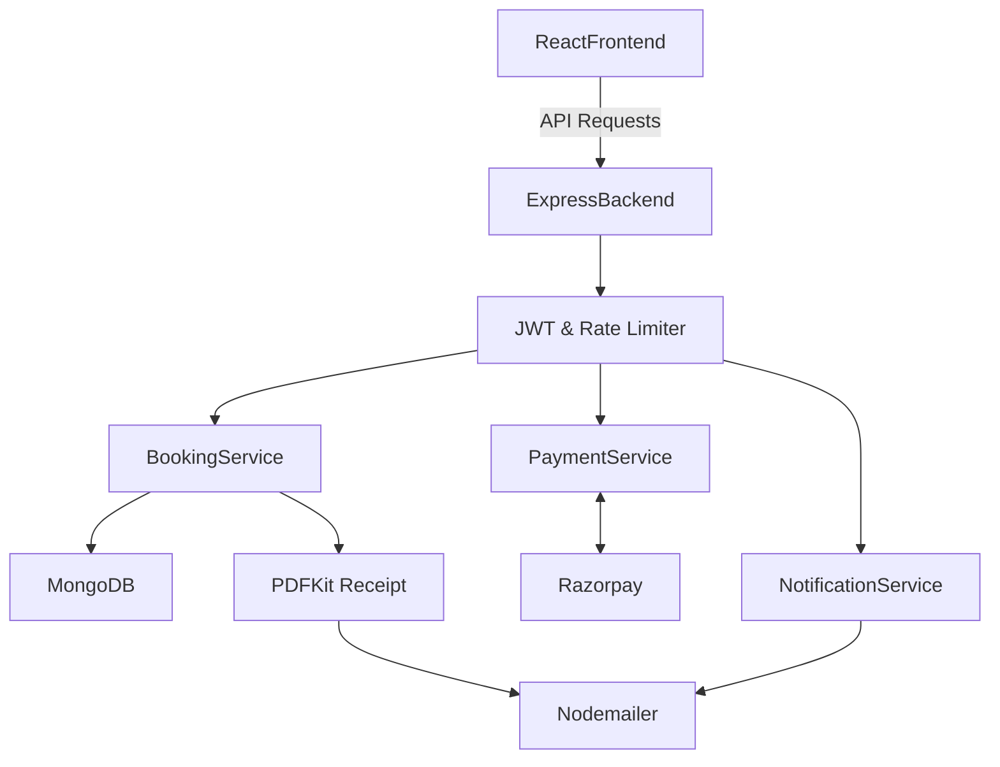

# Car Rental Application

A production-ready MERN stack car rental application featuring realistic payment flows, PDF generation, notification systems, and atomic database concurrency locks.

## Architecture & Features

### 1. Booking Flow & Concurrency
The application prevents double-booking using MongoDB's atomic `findOneAndUpdate` combined with ACID transactions. It guarantees that if multiple users attempt to book the exact same car at the exact same moment, only ONE booking succeeds and the rest gracefully fail.

### 2. Payment Verification (Razorpay)
Payments are verified securely on the backend. The server generates a Razorpay Order ID. When the frontend completes payment, the backend cryptographically verifies the `razorpay_signature` using the `RAZORPAY_KEY_SECRET`. Payments are **never** trusted based solely on frontend callbacks.

### 3. PDF Receipt Generation
Upon a successful booking, a detailed PDF receipt is generated entirely server-side using `pdfkit`. The receipt is securely accessible via an authenticated API endpoint.

### 4. Email & In-App Notifications
The `NotificationService` generates in-app notifications (viewable via a notification bell) and handles sending confirmation emails with the PDF receipt attached. Failed emails do not abort the successful booking.

### 5. API Rate Limiting
Endpoints are protected by `express-rate-limit`. There are varied limits depending on sensitivity:
- **General API**: 100 requests / 15 mins
- **Auth/Login**: 10 requests / 15 mins
- **Booking**: 20 requests / 15 mins
- **Payments**: 10 requests / 15 mins

## Getting Started

### Installation
1. Clone the repository
2. `cd server` && `npm install`
3. `cd ../client` && `npm install`

### Configuration
Copy `server/.env.example` to `server/.env` and fill in your details for:
- MongoDB URI
- Razorpay API Keys
- Nodemailer Credentials
- ImageKit Credentials

### Running
- Backend: `cd server && npm start`
- Frontend: `cd client && npm run dev`
